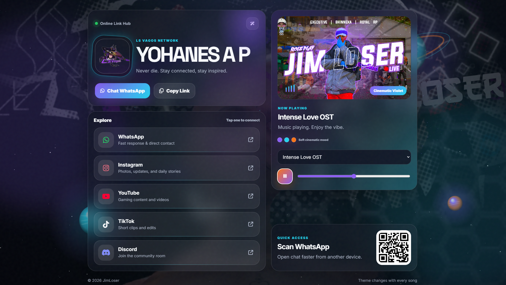
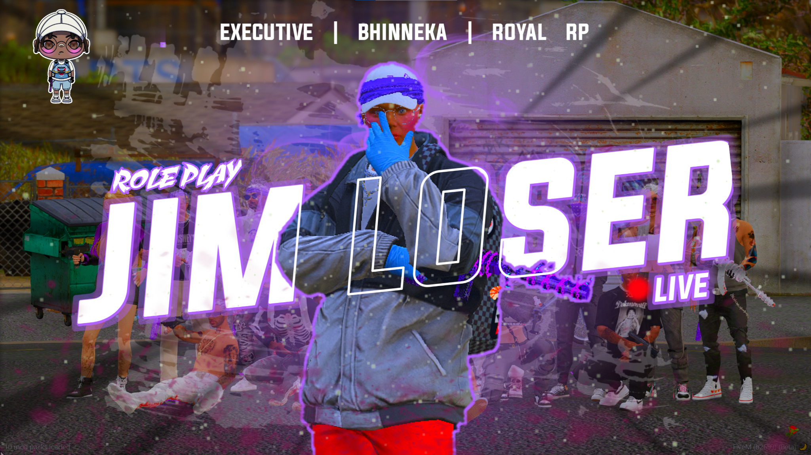

<div align="center">

# 🎵 YOHANES A P — Galaxy Planet Link Hub 🌌

### A modern social media link hub with dynamic music themes, galaxy canvas background, and premium glassmorphism UI.

<br>


<br>

[🌐 Live Demo](https://USERNAME.github.io/NAMA-REPO/) · [📁 Repository](https://github.com/USERNAME/NAMA-REPO) · [🎧 Music Theme](#-dynamic-music-theme)

</div>

---

## ✨ Overview

**Galaxy Planet Link Hub** adalah website link hub modern untuk sosial media.  
Project ini dibuat untuk menampilkan link sosial media, CTA WhatsApp, QR code, dan music player dalam tampilan visual yang lebih interaktif.

Website ini dibuat **statis** agar ringan, cepat, dan mudah di-deploy ke **GitHub Pages** atau **Vercel** tanpa konfigurasi backend.

---

## 🖼️ Preview

<div align="center">



<br><br>



</div>

---

## 🚀 Main Features

| Feature | Description |
|---|---|
| 📱 Mobile-first layout | Tampilan dioptimalkan untuk pengguna HP |
| 🌌 Galaxy planet background | Background berbasis Canvas dengan efek planet, ring, glow, dan star particles |
| 🎶 Dynamic music theme | Setiap lagu dapat mengubah warna, gradient, glow, planet, ring, dan player accent |
| 🧊 Glassmorphism UI | Card modern dengan efek transparan dan blur |
| 🌗 Dark/light mode | User dapat mengganti mode tampilan |
| 🎧 Music player | Playlist, volume control, equalizer, dan mood label |
| 📋 Copy link button | Memudahkan user menyalin link halaman |
| 💬 WhatsApp CTA | Tombol utama untuk kontak langsung |
| 🔍 SEO basic | Meta title, description, dan Open Graph dasar |
| ⚡ Fast deployment | Bisa langsung deploy ke GitHub Pages tanpa build step |

---

## 🛠️ Tech Stack

Project ini sengaja dibuat ringan tanpa framework berat.

```text
HTML5
CSS3
JavaScript
Canvas API
GitHub Pages / Vercel
```

Alasan tidak memakai framework berat:

- Lebih cepat dibuka.
- Lebih mudah dipahami pemula.
- Tidak butuh build step.
- Cocok untuk website Linktree personal.
- Mudah di-upload ke GitHub.

---

## 📂 Folder Structure

```text
.
├── index.html
├── style.css
├── java.js
├── assets/
│   ├── img/
│   │   ├── logo.jpg
│   │   ├── my_app_background.jpg
│   │   └── YT.png
│   └── audio/
│       └── music files
├── .gitignore
└── .nojekyll
```
---

## 🔗 Edit Social Media Links

Buka file:

```text
index.html
```

Cari bagian link sosial media seperti ini:

```html
<a class="social-card instagram" href="https://instagram.com/los.vagos_12">
```

Lalu ganti URL sesuai akun kamu.

Contoh:

```html
<a class="social-card instagram" href="https://instagram.com/usernamekamu">
```

---

## 🎨 Dynamic Music Theme

Buka file:

```text
java.js
```

Cari bagian:

```js
tracks
```

Setiap lagu punya pengaturan warna seperti ini:

```js
colors: {
  primary: "#8b5cf6",
  secondary: "#22d3ee",
  accent: "#f97316",
  orbA: "rgba(139, 92, 246, .30)",
  orbB: "rgba(34, 211, 238, .23)"
}
```

Kamu bisa mengubah warna sesuai mood lagu.

Contoh konsep tema:

| Mood Lagu | Primary | Secondary | Accent |
|---|---|---|---|
| Chill Night | `#8b5cf6` | `#22d3ee` | `#f97316` |
| Dark Galaxy | `#6366f1` | `#0ea5e9` | `#f43f5e` |
| Warm Sunset | `#f97316` | `#facc15` | `#fb7185` |
| Cyber Neon | `#22c55e` | `#06b6d4` | `#a855f7` |

---

## 🧩 Future Upgrade Ideas

Beberapa ide pengembangan berikutnya:

- Astro + Tailwind version.
- React component version.
- Admin dashboard untuk upload lagu.
- Login admin.
- API playlist.
- Database lagu.
- Custom domain.
- Analytics sederhana.
- Preview GIF animasi galaxy background.

## 📄 License

This project is open for personal learning and customization.

---

<div align="center">

### 🌌 Built with style, music, and galaxy energy.

**YOHANES A P — Galaxy Planet Link Hub**

</div>
